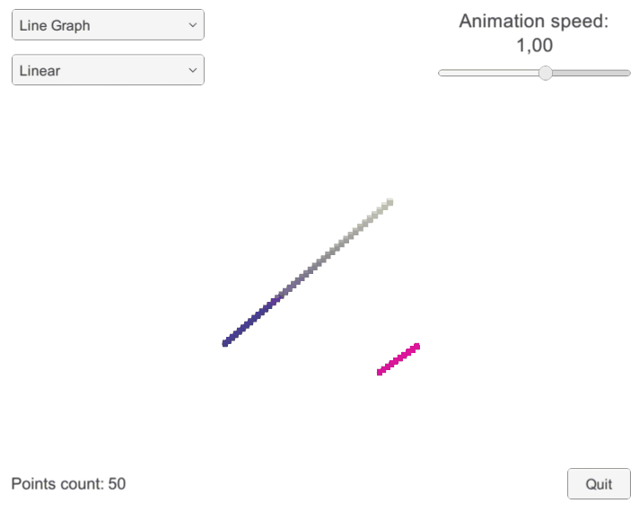

# Function Graph

Experiments with [tutorial](https://catlikecoding.com/unity/tutorials/basics/building-a-graph/).

  

## Tweaks

- Job System
- Burst Compiling
- UI stuff

## Performance tests

**LineGraph (Sine, 16 000 points)**

|     | fps | ms |
| --- | --- | ---- |
| no burst | 43 | 4.02 |
| burst | 57 | 0.34 |

**SurfaceGraph (Ripple, 16 384 points)**

|     | fps | ms |
| --- | --- | ---- |
| no burst | 37 | 4.78 |
| burst | 52 | 0.40 |

## Try it
1. [Download](https://github.com/dbpienkowska/function-graph/raw/master/Game/FunctionGraph.zip)
2. Unpack
3. Run `FunctionGraph.exe`
4. Play
